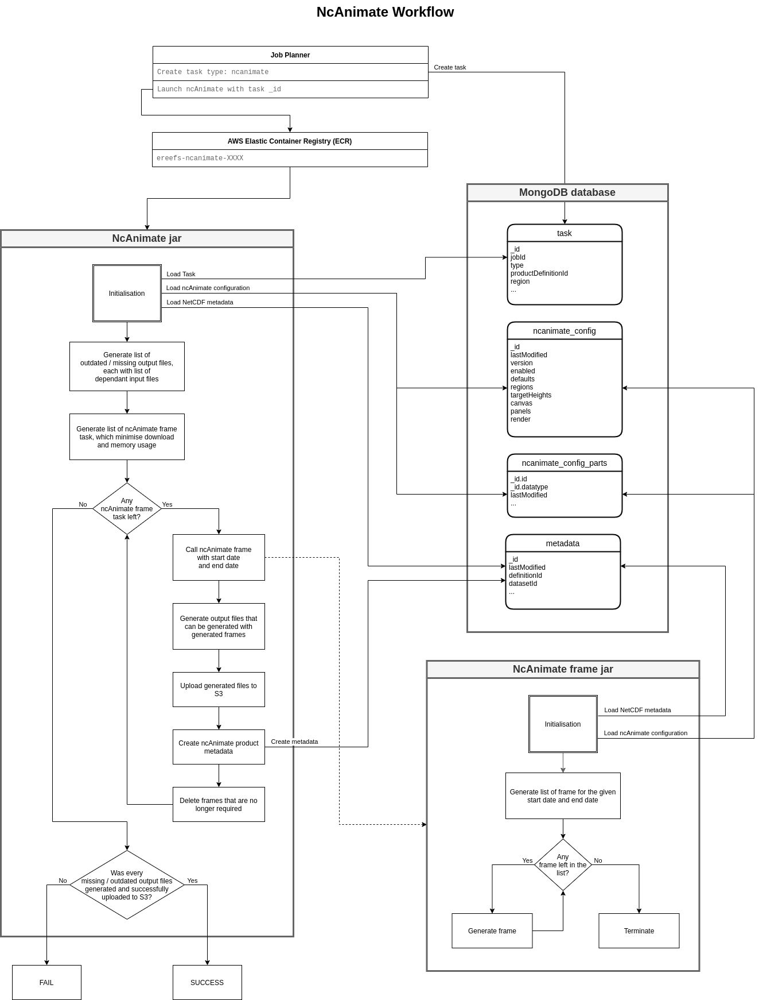
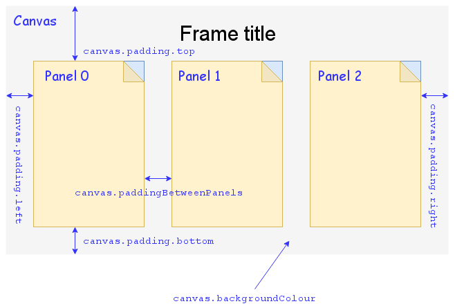
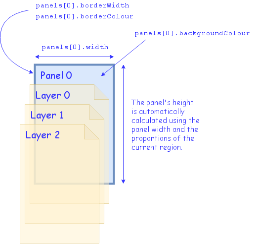

# NcAnimate

NcAnimate is a Java utility used to generate videos and maps from
[NetCDF files](https://www.unidata.ucar.edu/software/netcdf/docs/netcdf_introduction.html).



The application starts by loading a configuration file. It then determines what output files can be
generated given the input NetCDF files available. It checks what files have already been generated and
generate the missing ones or the outdated ones.

## Glossary

- `product`: A generated file. Can either be a video or a map.
- `video`: A video file, such as a MPEG4, AVI, etc.
- `map`: In the context of a generated file, a map refer to a static image file such as a PNG, SVG, JPEG, etc.
- `frame`: A raw file generated by `ncanimate2-frame`, used to generate a video and/or to produce a map.
- `field`: An attribute of a JSON configuration.
- `variable`: In the context of a configuration file, it's a placeholder used to refer to other part of the config
  or the generation context. See section [Substitution variables](docs/configuration/substitution-variables.md)
  of this document for more information.
  In the context of a NetCDF file, a [NetCDF variable](https://www.unidata.ucar.edu/software/netcdf/docs/netcdf_data_set_components.html#variables)
  refers to a multidimensional array of values.


## Structure of a frame

A frame contains text labels, and a set of panel. It needs to contain at least 1 panel.
There is no limit on the number of panel, but adding more panel increase the frame width.
It gets crowded when the number of panels get higher than 4.

Each panel can be configured independently.

Panels are rendered in the frame as followed:




Each panel contains a list of layers, drawn on top of each other.
The list of layer can be different for each panel.



## Configuration

[Configuration structure](docs/configuration/structure.md)

[Substitution variables](docs/configuration/substitution-variables.md)

## Code

[Code structure](docs/code/structure.md)

## Compile and install

This project depends on 3 other eReefs projects:

- `ereefs-database`
- `ereefs-ncanimate2-commons`
- `ereefs-ncanimate2-frame`

Open-AIMS GitHub repository for `ereefs-database`: https://github.com/open-AIMS/ereefs-database
This project is available through GitHub maven. You do not need to compile it locally.

Open-AIMS GitHub repository for `ereefs-ncanimate2-commons`: https://github.com/open-AIMS/ereefs-ncanimate2-commons
This project is available through GitHub maven. You do not need to compile it locally.

Let's assume the projects will be downloaded in the following repository: `~/projects`

1. Check-out, compile and package `ereefs-ncanimate2-frame`

    ```
    $ cd ~/projects
    $ git clone https://github.com/open-AIMS/ereefs-ncanimate2-frame.git
    $ cd ereefs-ncanimate2-frame
    $ mvn clean package
    ```

2. Check-out, compile and package `ereefs-ncanimate2`

    ```
    $ cd ~/projects
    $ git clone https://github.com/open-AIMS/ereefs-ncanimate2.git
    $ cd ereefs-ncanimate2
    $ mvn clean package
    ```

> **NOTE:** `ereefs-ncanimate2` assume it can find `ereefs-ncanimate2-frame-X.X-jar-with-dependencies.jar` jar
> in the following directory: `../ereefs-ncanimate2-frame/target`.
> If your `ereefs-ncanimate2-frame` jar is elsewhere, you will have to provide the path to the jar or its directory
> using the configuration field `render.ncanimateFrameJar` in your NcAnimate configuration file.
> See [Configuration structure](docs/configuration/structure.md) for more information.

## AWS Deployment / Execution

[AWS deployment](docs/aws/deployment.md)

[AWS execution](docs/aws/execution.md)
